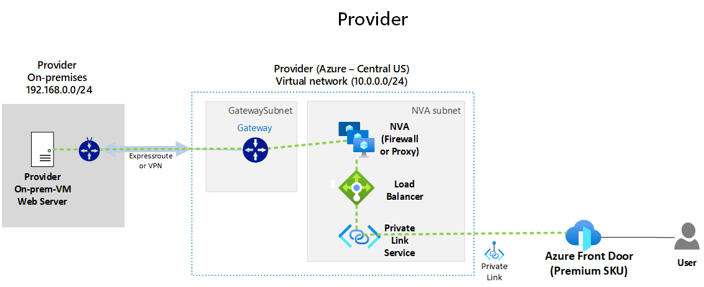

# Using Private Link Service for On-premises workloads

**In this article**

[Use case](#Usecase)

[Architecture diagram](#Architecturediagram)

[Concepts](#Concepts)

[Azure Front Door](#AzureFrontDoor)

[Lab this solution](#Labthissolution)

## Use case

 There is an increased customer demand Private Link to consume several mostly PaaS services. In the other hand, mostly due the popularity of Private Link, other scenarios have emerged where Azure customers want to publish their own services to be consumer by other Azure customers. For that the approach there's feature called Private Link Service (aka publish your own service).

In order to leverage Private Link Service as service provider it is necessary to have your workloads (IaaS mostly) to be placed behind an Azure Standard Load balancer (either public or internal) and have your virtual machine or scale set attached to it. Also you you have to create a Private Link Service and associate it to the Load Balancer front end IP. For more information, consult [What is Azure Private Link service?](https://docs.microsoft.com/en-us/azure/private-link/private-link-service-overview). In ther other side consumers, for customers who are also present in Azure their will create a Private Endpoint to be able to access published services that providers made available over Private Link Service.

The main solution referred by Microsoft documentation expects that provider's workloads to be published is present in Azure, more specifically in Azure Virtual Network. The question that remains and focus this article is: **how about On-premises workloads** like a Database or Web servers have that same capability to be offered over Private link service to other consumers privately using Azure?  That is exactly the scope of this post is to give customers a flexibility to also offer workloads outside of the Azure Virtual Network, like when they reside On-premises, to be consumed by other Azure customers (consumers).

It is important to keep in mind that there are several reasons customers may not be able to move their resources to Azure, to enumerate few of them listed here but not limited to:

1. Regulatory constrains that dictates that data must be present On-premises.
2. Application design requirements like legacy applications that are not ready to be modernized or moved to the Cloud.
3. Performance constrains that data has better performance being accessed from On-premises.
4. Costs to bring data from Cloud to On-premises like a database replication may incur in egress costs.

## Architecture diagram

This architecture diagram shows an Provider that has a Web Server on their On-premises network and wants to allow Customer A and Customer B to access it.

## Concepts

There are some important benefits of this solution as well as some  requirements to make this solution work properly. First, here are some benefits of using Private Link Service to publish On-premises workloads:

1. It works for **TCP and UDP** protocols.
2. Provider and consumer can have **overlapping IPs** (as shown on the architecture diagram all parties have same IP scheme).
3. Application is privately published over Azure (requires all parties have Azure Subscriptions). **Remove the need to build and manage complex VPN connections** that commonly used on this type of consumer/provider interconnection.
4. **There are not constrains of the presence of the provider and consumer over the Azure regions** (on the diagram above the provider is on Azure US Central, while consumers Customer A and Customer B are in different Azure regions, Azure East US on West US respectively).
5. **Provider's published on-premises workload** via PLS **can be also be accessible** not just from from Customer's Azure network via Private Endpoint but also **from customer's on-premises network** either by VPN or ExpressRoute connection.

Second, here are a breakdown of requirements from Providers and Consumers:

### Provider

- Azure Load Balancer Standard SKU (Public or internal).
- Private Link Service (PLS).
- NVA (IaaS mostly at this time) such as Firewalls, Reverse Proxy (Nginx or HA Proxy).
- Approval of Private Endpoint request (private link) to allow consumer to access published application over PLS.

### Consumer

- Azure Private Endpoint using a customer's VNET private IP.
- Proper DNS configuration to resolve Private Endpoint IP (optional).

## Azure Front Door

Another capability customers can leverage from this solution is to use Azure Front Door Premium SKU to publish their On-premises Web applications to Internet via Azure. That allows customer to have their web application ready to be scaled globally by taking advantage of application acceleration such as caching of web application content content over hundreds of [Microsoft Content Delivery Network Points-of-presence (CDN PoPs)](https://docs.microsoft.com/en-us/azure/cdn/cdn-pop-locations) as well as enforce Web Application Security (WAF) to proper secure it.

## Lab this solution

You can lab this solution fully and test all moving parts by leveraging the following lab guide: (Link to be added)
